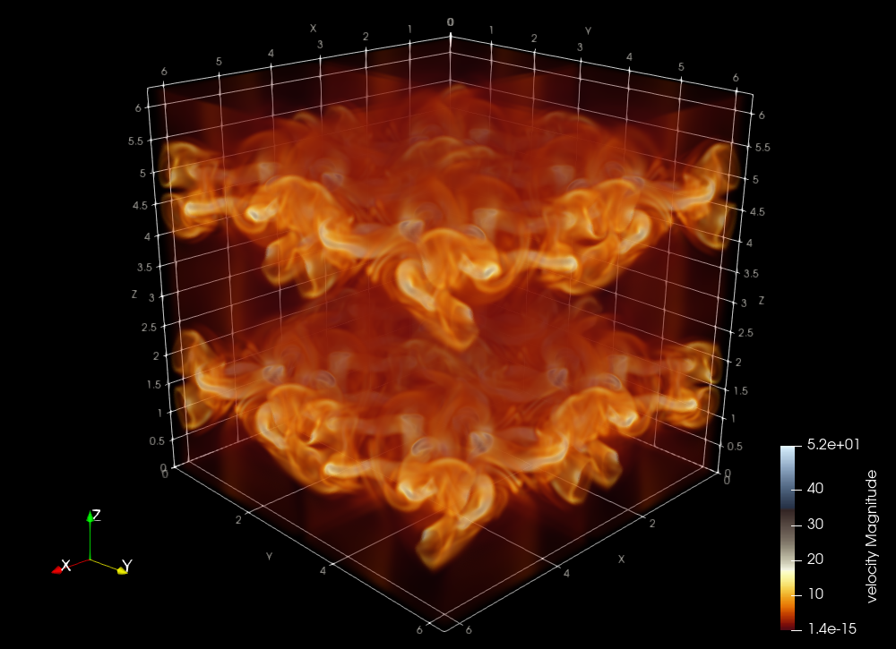
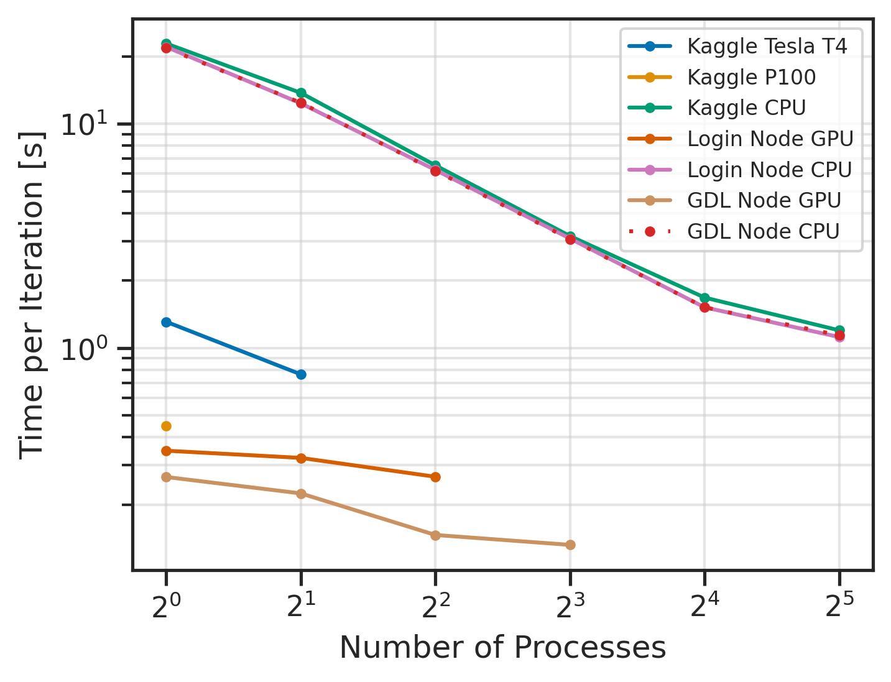
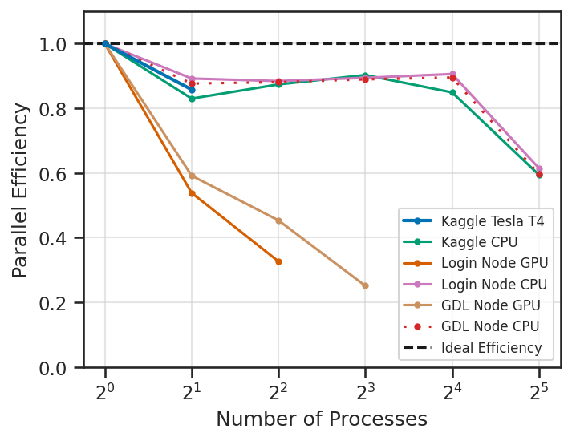
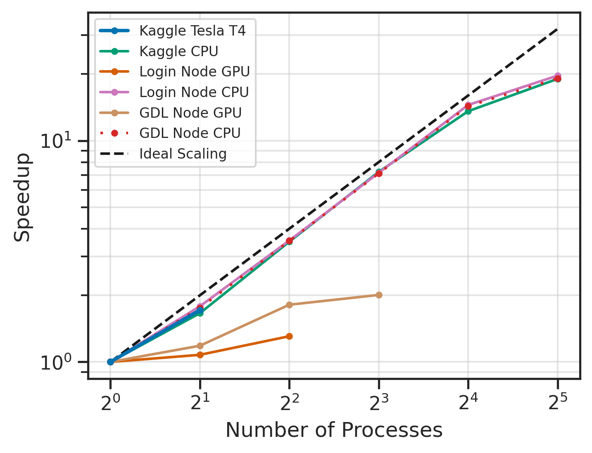
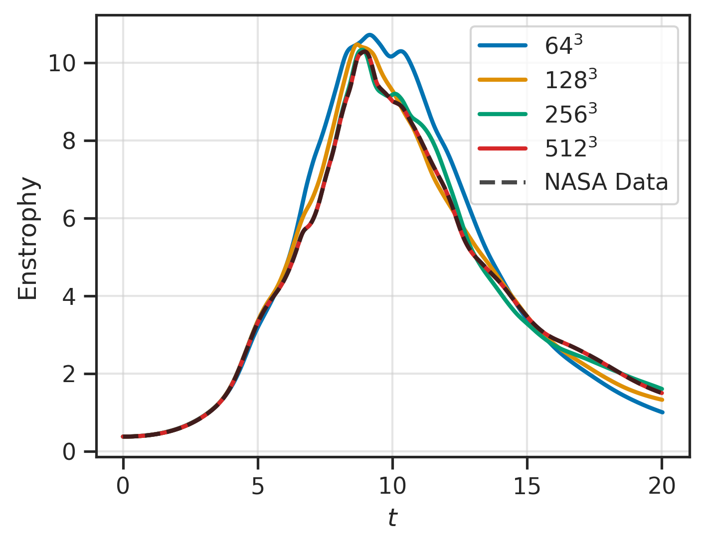
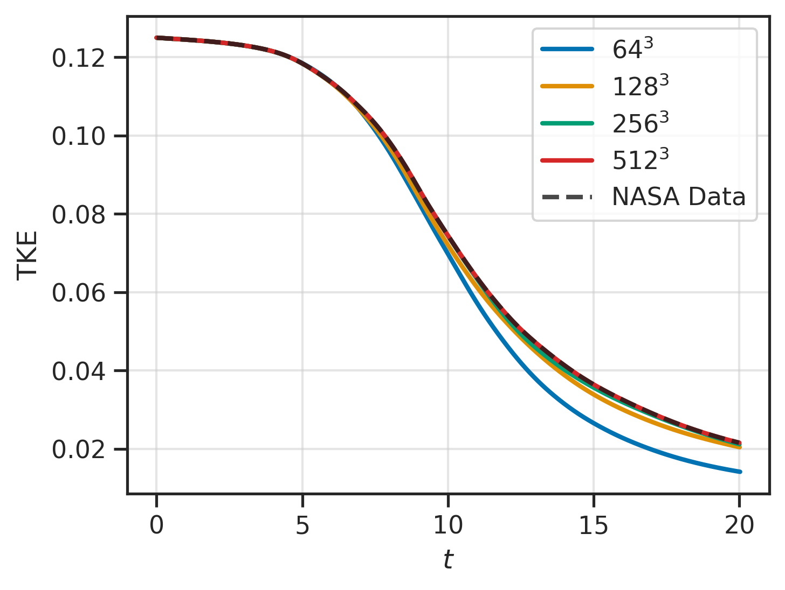
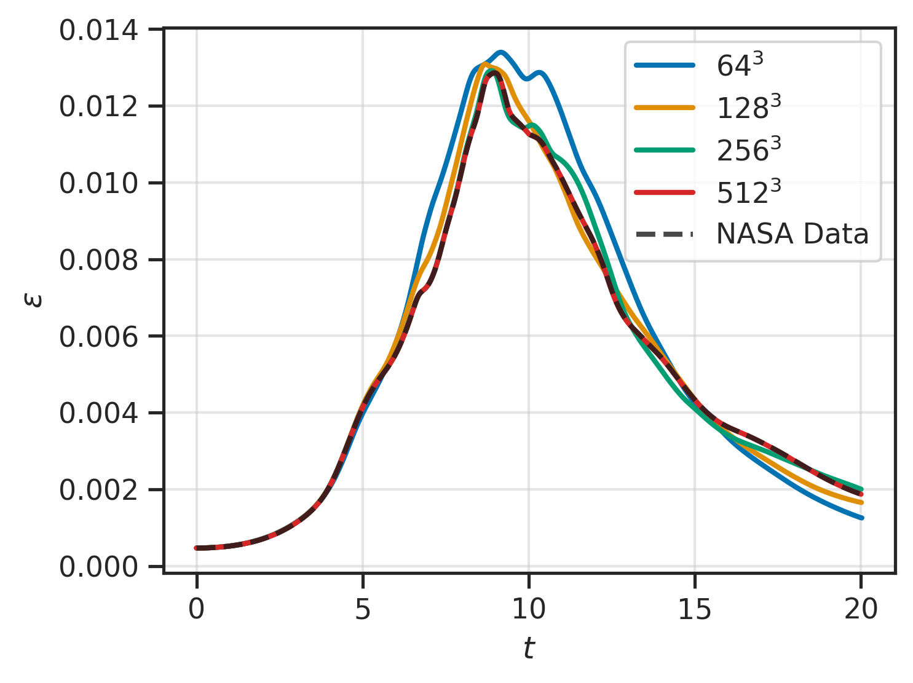
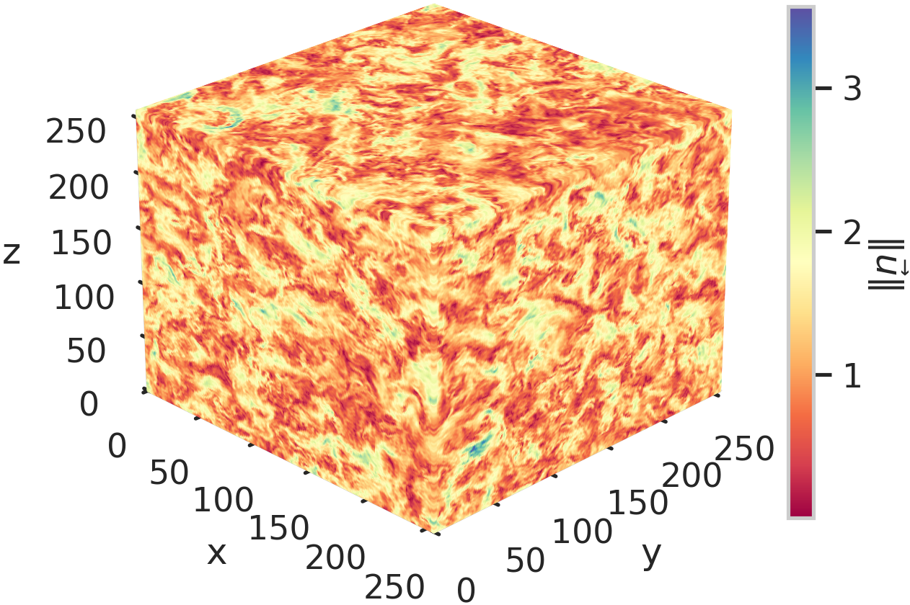
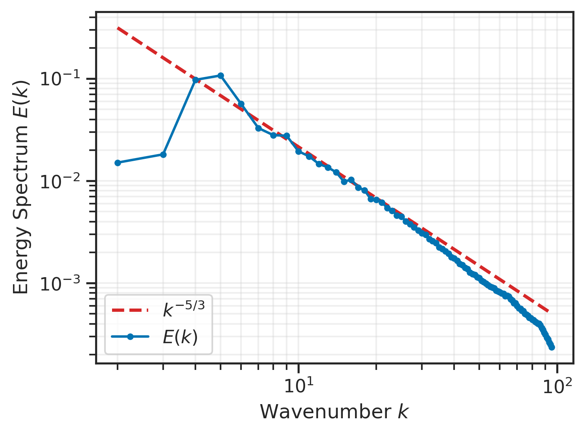

# PyTurbulence: Multi-GPU Accelerated DNS Turbulence Simulator in Python

**PyTurbulence** is a Python-based solver for GPU accelerated simulations of three-dimensional homogeneous isotropic turbulence (HIT) using the spectral Galerkin method. The implementation supports GPU acceleration and parallelization across multiple GPUs using `mpi4py`, CuPy, and NCCL, making it suitable for both small-scale tests and large-scale simulations on supercomputers.

The codebase is organized around Jupyter notebooks and is compatible with free platforms such as Google Colab and Kaggle. It also scales seamlessly without modification to HPC systems like the Santos Dumont supercomputer. 

Example code is available in the ``Src`` folder. For 3D simulations, a decaying multi-GPU case and a forced example are available.

> Code not present on this repository can be provided upon request.

<div align="center">
  
  <p><strong>Figure 1:</strong> Norm of the vorticity field for a Taylor-Green simulation at t=8.</p>
</div>


## Performance Metrics

The performance metrics were computed on the Santos Dumont I supercomputer using the GPUs and CPUs of the Login Node and the GDL node. Also, the metrics were computed on the Kaggle platform GPUs and on the TPU instance CPUs.

<div align="center">
  
  <p><strong>Figure 2:</strong> Time per iteration as a function of the number of processes for different GPU and CPU tested hardware configurations.</p>
</div>

<div align="center">
  
  <p><strong>Figure 3:</strong> Parallel efficiency as a function of the number of processes for different GPU and CPU tested hardware configurations.</p>
</div>

<div align="center">
  
  <p><strong>Figure 4:</strong> Speedup as a function of the number of processes for different GPU and CPU tested hardware configurations.</p>
</div>


## Validation

Validation of the solver was done using the Taylor-Green (T-G) case data made available on the NASA International Workshop on High-order CFD Methods. Results for different mesh resolutions can be seen on Figures 5, 6 and 7.

<div align="center">
  
  <p><strong>Figure 5:</strong> Temporal evolution of the enstrophy for different grid resolutions compared with reference data.</p>
</div>

<div align="center">
  
  <p><strong>Figure 6:</strong> Temporal evolution of total kinetic energy for different grid resolutions compared with the NASA reference data.</p>
</div>

<div align="center">
  
  <p><strong>Figure 7:</strong> Temporal evolution of energy dissipation rate $\epsilon$ for different grid resolutions compared with reference data.</p>
</div>


## Forced Simulation

A example of forced homogeneous and isotropic turbulence can be seen on Figures 8 and 9. The forcing scheme was based on forcing the wavenumbers 4, 5 and 6.

<div align="center">
  
  <p><strong>Figure 8:</strong> Norm of the velocity field for a snapshot of forced HIT.</p>
</div>

<div align="center">
  
  <p><strong>Figure 9:</strong> Power spectra for the snapshot in Figure 5.</p>
</div>


## Project Structure

```
PyTurbulence/
├── Data/                 # Raw and processed datasets
├── Data_analysis/        # Jupyter notebooks for data analysis and experiments
├── Docs/                 # Documents and additional resources
├── Experimental/         # Experimental code and prototypes
├── External_projects/    # Projects and code from external repositories
├── Slurm/                # Example slurm scripts
├── Src/                  # Source code for 3D and 2D simulations
├── Tools/                # Additional tools
├── README.md             # Project documentation
├── LICENSE               # License information
```